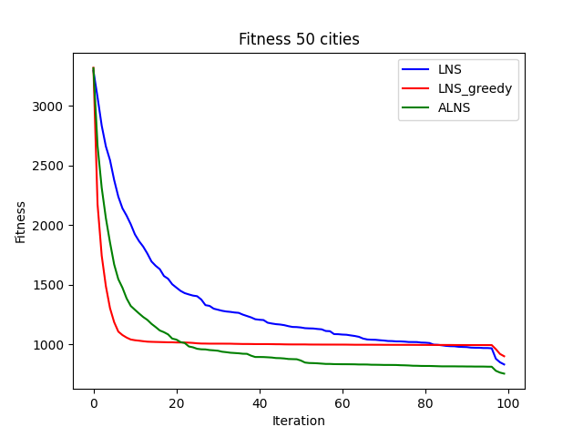
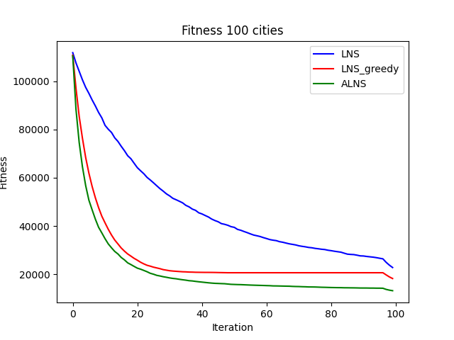
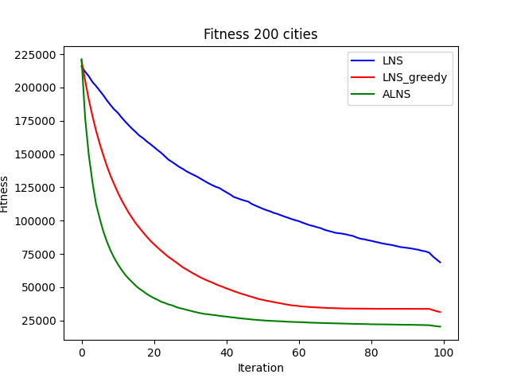

# Travelling Sale Man Problem with drone
## 1.Problem
- Find the route that minimizes total emissions while maximizing customer satisfaction for a truck combined with a drone supporting deliveries.
## 2. Algorithms
- Large Neighboorhood Search (LNS)
- Greedy Large Neighboorhood Search (Greedy LNS)
- Adaptive Large Neighboorhood Search (ALNS)
## 3. Version 1 - solve TSP
- None drone
## 4. Version 2 - solve TSPD
- In this vertion, the source doesn't have constraits of wating time between truck and drone. Additional, the drone_limit_flight is infinity
## 5. Version 3 - Solve TSPD with constraits
- In the lastest vertion, i use the fitness formula include Customer Sastification and Gas emission

- About drone_limit_flight i use formula:
            
    **distance(i-1,i) + distance(i,i+1) <= limit drone distance**

## 6. Result
- I have run the code for three algorithms and saved the results of 20 runs into the CSV files above.

- I illustrate the result of three algoritms after running 20 times with 100 interation to compare them.

